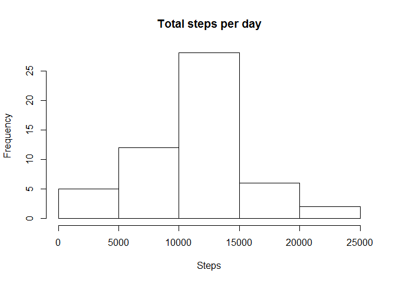

# Reproducible Research: Peer Assessment 1

# Reproducible Research: Peer Assessment 1

## Loading and preprocessing the data


```r
setwd('C:/Users/Jane_Liao/Desktop/JL/Coursera/5. Reproducible research/W2/')
activityraw <- read.csv("activity.csv")
activity <- activityraw[!is.na(activityraw$steps),]
activity$day <- weekdays(as.Date(activity$date))
```

## What is mean total number of steps taken per day?

Calculate the total number of steps taken per day


```r
sumTable <- aggregate(activity$steps~activity$date, FUN = sum, )
colnames(sumTable)<-c("Date","Steps")
```

Make a histogram of the total number of steps taken each day


```r
hist(sumTable$Steps, breaks = 5, xlab="Steps", main = "Total steps per day")
```



Calculate and report the mean and median of the total number of steps taken per day


```r
mean(sumTable$Steps, na.rm=TRUE)
```

```
## [1] 10766.19
```

```r
median(sumTable$Steps, na.rm=TRUE)
```

```
## [1] 10765
```

## What is the average daily activity pattern?

Make a time series plot (i.e. type = "l") of the 5-minute interval (x-axis) and the average number of steps taken, averaged across all days (y-axis)


```r
library(ggplot2)
intervalTable1 <- aggregate(activity$steps~activity$interval, FUN = mean,)
colnames(intervalTable1) <- c("Interval","Avg")
ggplot (intervalTable1,aes(x=Interval,y=Avg)) +
        geom_line()+
        xlab("The 5-minute Interval")+
        ylab("The Average Number of Steps Taken")
```

<!-- -->

Which 5-minute interval, on average across all the days in the dataset, contains the maximum number of steps?


```r
max <- max(intervalTable1$Avg)
intervalTable1 [intervalTable1$Avg==max,1]
```

```
## [1] 835
```

## Imputing missing values

Calculate and report the total number of missing values in the dataset (i.e. the total number of rows with NAs)

```r
nrow(activityraw[is.na(activityraw$steps),])
```

```
## [1] 2304
```

The strategy filling in all of the missing values in the dataset will be to use the mean for that 5-minute interval.


```r
library(plyr)
avgTable <- ddply(activity, .(interval, day), summarize, Avg = mean(steps))
activityraw$day <- weekdays(as.Date(activityraw$date))
nadata<- activityraw[is.na(activityraw$steps),]
newactivity <- merge(nadata,avgTable,by=c("interval","day"))
```

Create a new dataset that is equal to the original dataset but with the missing data filled in

```r
newactivity <- newactivity[,c(5,4,1,2)]
colnames(newactivity) <- c("steps","date","interval","day")
new <- rbind(activity,newactivity)
```

Make a histogram of the total number of steps taken each day 


```r
sumTable2 <- aggregate(new$steps~new$date, FUN = sum, )
colnames(sumTable2)<-c("Date","Steps")
hist(sumTable2$Steps, breaks=5, xlab="Steps", main = "Total Steps per Day", col="Black")
hist(sumTable$Steps, breaks=5, xlab="Steps", main = "Total Steps per Day", col="Grey", add=T)
legend("topright", c("ALL Data", "Non-NA Data"), fill=c("black", "grey") )
```

<!-- -->

Calculate and report the mean and median of the total number of steps taken per day


```r
mean(sumTable2$Steps, na.rm=TRUE)
```

```
## [1] 10821.21
```

```r
median(sumTable2$Steps, na.rm=TRUE)
```

```
## [1] 11015
```

Mean and median values are higher after imputing missing data. The reason is that in the original data, there are some days with `steps` values `NA` for any `interval`. The total number of steps taken in such days are set to 0s by default. However, after replacing missing `steps` values with the mean `steps` of associated `interval` and `weekday`value, these 0 values are removed from the histogram of total number of steps taken each day.

## Are there differences in activity patterns between weekdays and weekends?

Create a new factor variable in the dataset with two levels - "weekday" and "weekend" indicating whether a given date is a weekday or weekend day.


```r
new$DayCat <- ifelse(new$day %in% c("Saturday", "Sunday"), "Weekend", "Weekday")
```

Make a panel plot containing a time series plot (i.e. type = "l") of the 5-minute interval (x-axis) and the average number of steps taken, averaged across all weekday days or weekend days (y-axis). 


```r
library(lattice)
intervalTable2 <- ddply(new, .(interval, DayCat), summarize, Avg = mean(steps))
xyplot(Avg~interval|DayCat, data=intervalTable2, type="l",  layout = c(1,2),
       main="Average Steps per Interval Based on Day Type", 
       ylab="Average Number of Steps", xlab="The 5-minute Interval")
```

<!-- -->

The step activity trends are different based on the day type. This may be due to people having more time during weekend.
